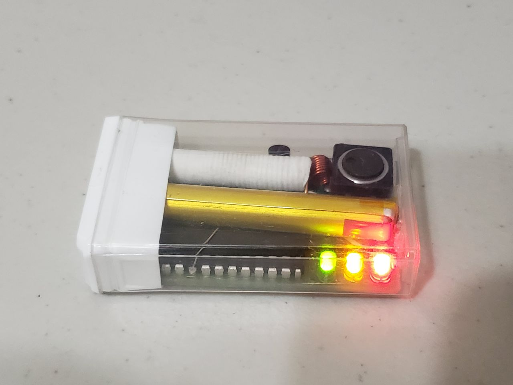
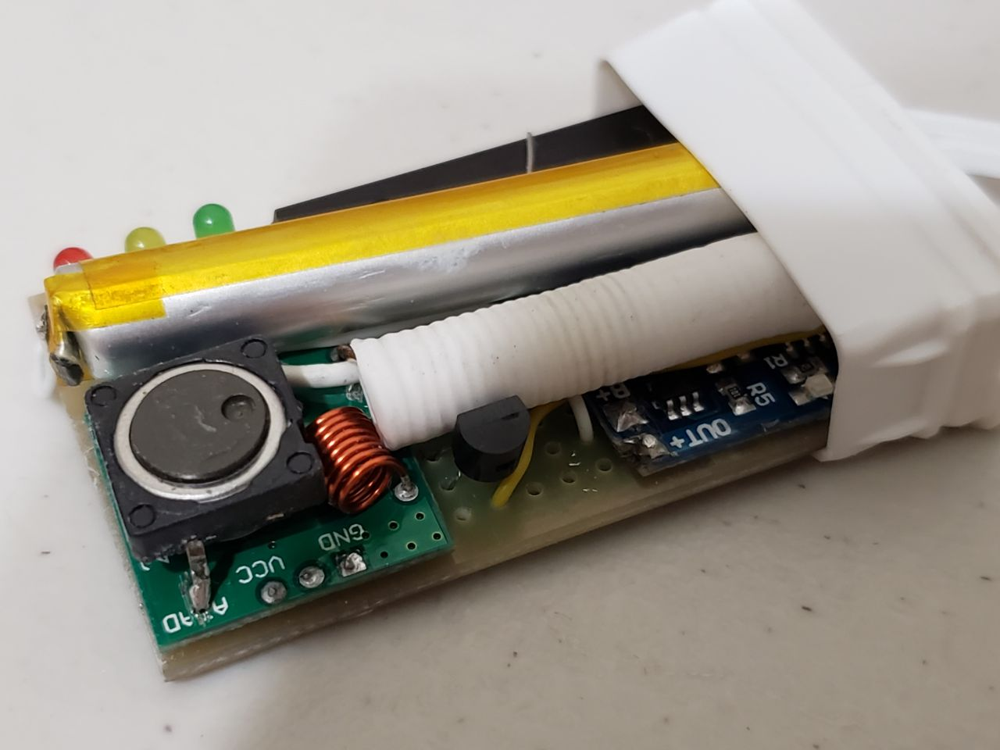
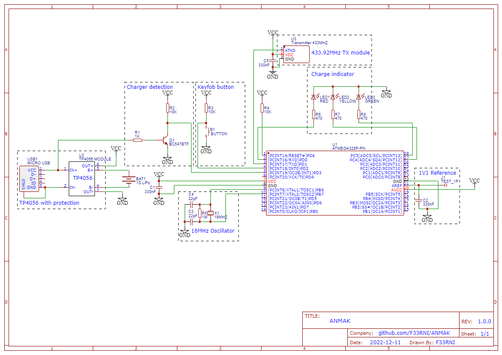

# ANMAK
## AN-Motors Arduino Keyfob

    

        
        
        
    

    

        
        
    

----------

### Schematic

    

        
    

----------

### Disclaimer

**IN NO EVENT SHALL THE AUTHOR BE LIABLE FOR ANY CLAIM, DAMAGES OR OTHER LIABILITY, WHETHER IN AN ACTION OF CONTRACT, TORT OR OTHERWISE, ARISING FROM, OUT OF OR IN CONNECTION WITH THE SOFTWARE OR THE USE OR OTHER DEALINGS IN THE SOFTWARE**

**By using the project, you confirm that you have permission to broadcast the relevant radio signals**

----------

### Description

This is a project of a remote key fob for controlling gates / barriers from AN-Motors (or others if they do not have encryption and use OOK modulation at a frequency of ~ 433MHz). AN-Motors uses similar packets to keeloq but without encryption

1. Using the rtl-433 project (Keeloq packets) or any other method, get a packet from your gate / barrier
    * Example of demodulated AN-Motors packet for ID 0x12345AB (0x0DA2C48): https://triq.org/pdv/#AAB0160401019803381010271880808080808080808080808255+AAB04C0401019803381010271890908190909090909090819090819090818181908181908181818190818190819090908190908190909081819081909090819081819081908190818190819090818355
    * Packet consists of 4 same packets:
    1. 12-bit preamble (ON -> wait 413us -> OFF wait 413us)
    2. 4130 us pause
    3. 66-bit payload (64bit + battery and repeat flags)
    4. ~16100 us pause
    * Payload structure:
    1. 12-bit `0x202` header (probably a constant) `0010 0000 0010`
    2. 4-bit button code (ex. `0100`)
    3. 8-bit + 8-bit random number (you can use constant) (ex. `0xEDED` or `0xABAB` or `0x9797` etc.)
    4. 28-bit ID (ex `0001001000110100010110101011`) **NOTE: rtl433 shows ID in little-endian. If you use the ID from rtl_433, you need to flip it**
    5. 4-bit button code again (ex. `0100`)
    6. Two bits of ones (`11`) (battery and repeat flags)

2. Exctract ID from the packet in big-endian format. **NOTE: rtl433 shows ID in little-endian. If you use the ID from rtl_433, you need to flip it**
    * Example of packet: 00100000001001001110110111101101**0001001000110100010110101011**010011. So, ID is `0001001000110100010110101011` in BIN or `12345AB` in HEX

3. Put this ID (28-bit) to the code

4. Put button code to the code
    * Example of packet: 001000000010**0100**11101101111011010001001000110100010110101011**0100**11. So, 1st button is pressed with code `0100` in BIN

5. Assemble device with whatever you find

6. Uncomment `REF_CALIBRATION`, measure AREF voltage in mV and put into the VREF_ACTUAL_MV `variable`

7. Comment `REF_CALIBRATION`, upload code, connect battery. Done!
